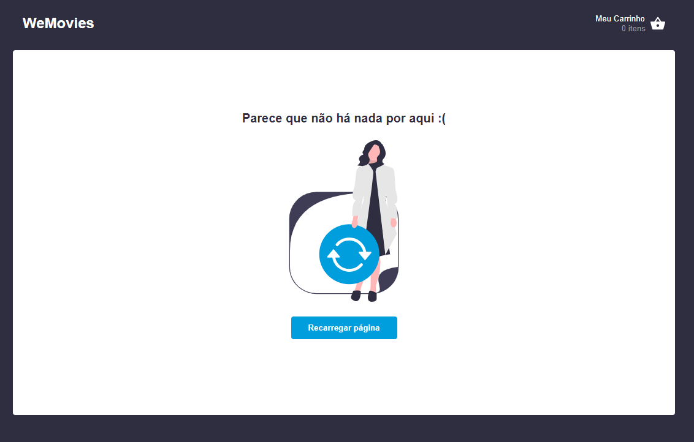
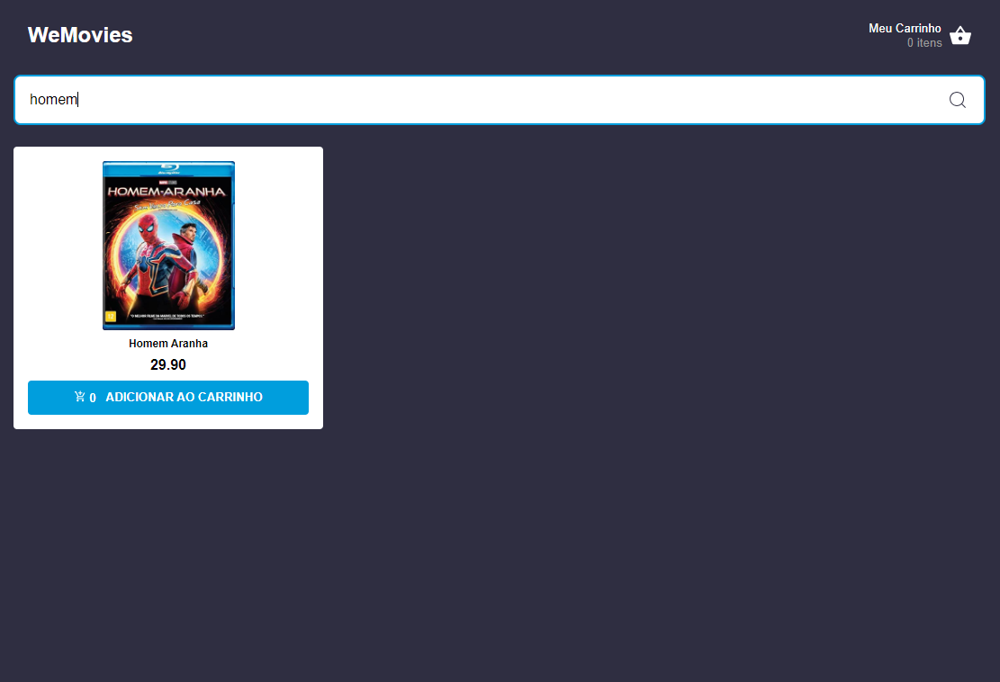
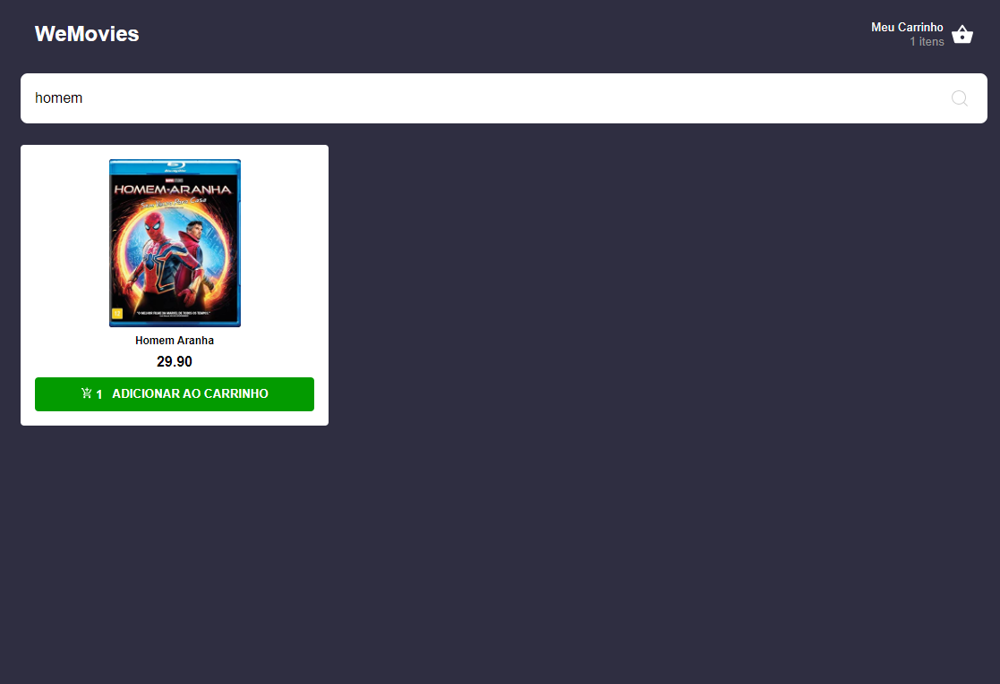

## como rodar 

```bash
npm i
npm run json-server
npm run dev
```

## arquitetura
```shell

src/
|-- pages/(paginas_da_aplicão)
|   |-- home/
|   |-- Cart/
|   |-- PurchaseMade/
|   |   |-- index (view)
|   |   |-- model (hook)
|   |   |-- style (styles)
|-- Service/(camada_de_acesso)
|   |-- api/ (intancia)
|   |-- http/ (request)
|   |-- query/ (query-do-react-query)
|   |-- mutate/ (mutate-do-react-query)
|-- main/(camada_de_entrada_da_aplicão)
|   |-- main
|   |-- index.css
|-- components/(componentes_da_UI)
|   |-- button/
|   |-- CardProduct/
|   |   |-- CardProduct.stories(doc_do_componente)
|   |   |-- index.tsx(view)
|   |   |-- styles(estilos)
|-- models/(interfaces_do_sistema)
|   |-- Product(interfaces)
|-- routes/(rotas_da_aplicão)
|   |-- index(rotas)
|   |-- path(enderecos_das_rotas)
|-- layout/(componentes_que_ficam_ao_redor_como_header)
|   |-- index
|-- context/(criando_contexto)
|   |-- index
 
 
```


## imagens do projeto




